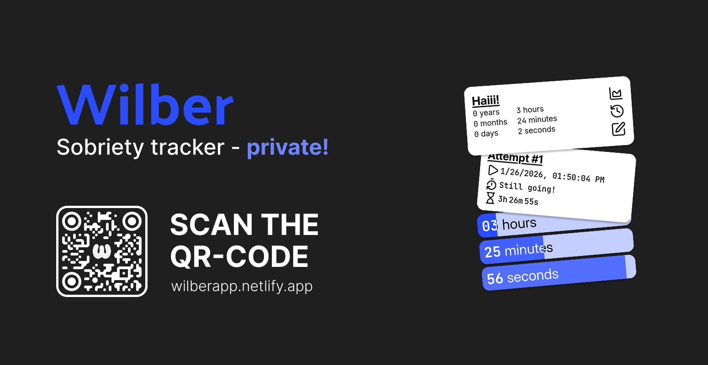

# Wilber

Wilber is a free & open-source Sobriety tracker running fully local inside your browser.

## Images

### Banner



## Contributing

Contributions are always welcome! To add a new theme you can head to the [consts.ts](./src/consts.ts) file, add the identifier and display name (["IDENTIFIER", "DISPLAY_NAME"]) to the themes Array and set the values of your theme in the [index.css](./src/index.css) file.

```css
body[data-theme="IDENTIFIER"] {
  --background: VALUE;
  --background-1: VALUE;
  --background-hover: VALUE;

  --border: VALUE;

  --accent: VALUE;
  --text: VALUE;

  --blue: VALUE;
  --blue-1: VALUE;
  --blue-2: VALUE;
  --blue-3: VALUE;
  --blue-4: VALUE;
  --blue-5: VALUE;
  --blue-bg: VALUE;

  --green: VALUE;
  --red: VALUE;
}
```

Feel free to make other changes too (like the alien theme changing the logo).

## License

This project is licensed under [MIT](./LICENSE).